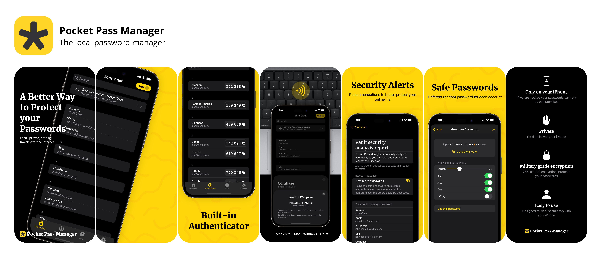

# Automated AppStore Screenshots - How To
This repo is a guide on how to create beautiful AppStore screenshots fully automated, with a localizable approach, without external tools.

**I’m building the App Store screenshots for my app, [Pocket Pass Manager](https://apps.apple.com/us/app/pocket-pass-manager/id1563839314), completely with SwiftUI.** And oh boy **it’s the best thing I have ever made.**



## Motivation

**A tweet took me on a rabbit hole for the past week.** A developer was posting their new very impressive screenshots, made with an online free tool. [Here is the tweet in question](https://twitter.com/SebastianRoehl/status/1618174959267840000) (the app looks amazingly good, I may add).

This post is because I tried the posted tool, and it was equally bad.

**My problem with screenshots has been always quality vs. time.** I know how to make impressive ones, but takes me ages, and I also know how to make fast ones but the result is crappy at best.

> I'm referring to screenshots with device bezels and some design. 
> 
> You can automate the basic screenshots with `fastlane`, but on today's App Store that's not competitive enough.

Let me discuss the alternatives (I have used):

## High quality + high time
I know how to build great screenshots, I'm proficient on Adobe Illustrator, and I can do very cool stuff from the ground up, but this is not by any means scalable.

Illustrator (or similar design programs) don't work for small teams or solo developers:

* **Languages.** Once you start introducing different languages the number of files you need to keep updated is just enormous.
* **New features.** When you add a new feature it’s a day of work at least, as you need to add the same screen to a bunch of language files and paste the translations in.
* **Changes on layout.** Even more headache if you start changing the overall design, you need to propagate the changes or start over.
* **UI tweaks and changes to the app.** Even worst I constantly tweak my apps' UI. But updating the screenshots because a button changed name, is just not worth it. 

And thus, good screenshots are always outdated. Only large teams with designers on hand (or poor interns) can manage to keep the screenshots updated, and even they rarely do.

This is the way I have done screenshots for the [Reliby app](https://apps.apple.com/es/app/reliby-glasses-try-on/id1499175958?l=en), and is an absolute pain. Still, not all languages the app supports have screenshots, and updates are deferred until more substantial changes pile up, it just takes too much time.

## Low quality + low time
Automate everything with Fastlane! [Fastlane Frameit](https://docs.fastlane.tools/actions/frameit/) can add device bezels to the screenshots and also add texts on top. 

You can supply plain text files translated to different languages to enjoy localized texts and screenshots. 

A win win, for small teams and solo developers. But the quality and design options leave a lot to be desired.

I used this approach for [Pocket Pass Manager](https://apps.apple.com/us/app/pocket-pass-manager/id1563839314), as it is a passion project. 

But it bothers me a lot because I put a lot of care in making this app perfect. And I cannot make the screenshots perfect because it would take me way more time than coding the app, and so I'm stuck with a bad presentation to a great app... AAAAARRRGGG! -exhales in desperation-.

## Medium quality + medium time
This is the realm of online tools! I'm sure there are hundreds, with their own advantages and tradeoffs, as well as pricing. 

> I also know that I know around none of them. So leave me alone in the comments, as all of this is just to show you an alternative, later on the post.

The tweet that started my journey to screenshots spoke about [AppMockUp](https://app-mockup.com). It's an amazing tool, you can build very beautiful stuff there, and it's also free. 

I did built a whole new design for Pocket Pass Manager there on just a few minutes with amazing results.

But the dream rapidly became a nightmare when I started the localization process. 

It became the same process as with Illustrator, everything done clicking here and there while duplicating the project. Any future updates would take the same time, as doing it on Illustrator.

All these tools also come with restrictions on layout design, as you are forced to use their templates, you cannot let your imagination fly.

I know other tools exists that also help with the localization process. But still they don't fit on my ideal work pipeline: write a command on the terminal and forget about it.

## A new way: High quality + low time
This journey took me to rediscover myself, to rethink about my life goals, and to **devise a whole new paradigm to build the screenshots, and I'm writing this so I can illuminate your journey too.**

**What if I used SwiftUI to create the screenshots?** Just as I can build complex interfaces in a declarative way (interfaces that scale and adapt to different languages and device sizes). 

I could use the same SwiftUI to build the screenshots, and capture them (render them) with Fastlane, as the regular "raw screenshots" I capture for [Reliby](https://apps.apple.com/es/app/reliby-glasses-try-on/id1499175958?l=en) and [Pocket Pass Manager](https://apps.apple.com/us/app/pocket-pass-manager/id1563839314)!

**Using SwiftUI to frame and layout your app's screenshots.** Here is the pipeline:

### 1. Capturing your app screenshots
These are the app screens, nothing else, just as if you took screenshots on the simulator.
1. Set up `Fastlane Snapshots`, [here are the docs.](https://docs.fastlane.tools/actions/snapshot/)
2. On the `Snapfile` change the output directory to `raw-screenshots`.
3. On the `Snapfile` select the languages and devices.

    > The devices won't represent the final size of the screenshots for the App Store. For example I only use an iPhone 14 pro, and use that device framed for all screenshot sizes.

### 2. The Frames project
Now we will create a project, an app where the real magic happens, where we create the layouts for the App Store screenshots.

1. Create a new Xcode project, a SwiftUI app called `Frames`, I recommend in the same `workspace`.
2. On the project `Build Phases` add the `raw-screenshots` folder previously created. 
  
    Leave unchecked `copy items if needed`. So when you update the raw screenshots, they will be updated on the `Frames` app also.
3. Now is creativity time, create different views and designs for the screenshots. Remember this is the layout people will see on the App Store.
  
    I created a `FramedIPhoneView.swift` so I can provide an `Image` and it will be framed, reusing it in most other views.
   
    Make sure the screenshot views work at least on the required App Store sizes *(right now iPhone 14 Plus and iPhone 8 Plus)*.
4. Remember to use localization for the texts you use.
5. Use the images on `raw-screenshots` for the app.
   
   You can use the current locale to know which language path to use, or the fastlane arguments. 
  
    This is how you access the image for a given language `UIImage(named: "raw-screenshots/\(lang)/iPhone 14 Pro-ScreenshotName.png"`
6. Setup a new `Fastlane Snapshots` for the `Frames` project.
   
   Set up as snapshots output the main app's `screenshots` folder, so you can use `fastlane deliver` to upload your new screenshots.

    You can instantiate the views directly from the `Snapshot UITests`, or on the `ContentView` by passing arguments to the app during the test set up: 
    
    ```Swift
    // Add args
    app.launchArguments.append("hero-screen")

    // Read args
    if ProcessInfo.processInfo.arguments.contains("hero-screen") { ... }
    ```

    Remember to hide the status bar and navigation bar on the `ContentView`:

    ```Swift
    var body: some View {
        ...
    }
    .statusBar(hidden: true)
    .persistentSystemOverlays(.hidden)
    ```

**That's it!**

When you want to create/update the screenshots, just run the `fastlane snapshot` command for the main app, and then the same for the `Frames` app.

When you want to tweak them, just edit the views on the `Frames` project and run it again, it's that simple.

Here are the advantages:
* **Languages.** Support all languages your app supports, under the same translations pipeline. As the layout is build by SwiftUI it will always look good, and you can test for shorter and larger languages.
* **New features.** When you add a new feature it’s just adding a new screen to the frames app, reusing layout or not. 
* **Changes on layout.** This changes are declared on SwiftUI and propagated to all languages.
* **Changes to the app.** Any changes to the UI can be easily incorporated to the screenshots.
  
The setup process might be a pain, but it's barely more than doing it on Illustrator for just one language, and it's waaaaay more scalable with very similar results.

Right now each time I update any minor UI element, I can just update the screenshots without doing more work than a couple of commands on the terminal. 

**For me this is mind blowing, I hope I can help you get rid of headaches too!**
